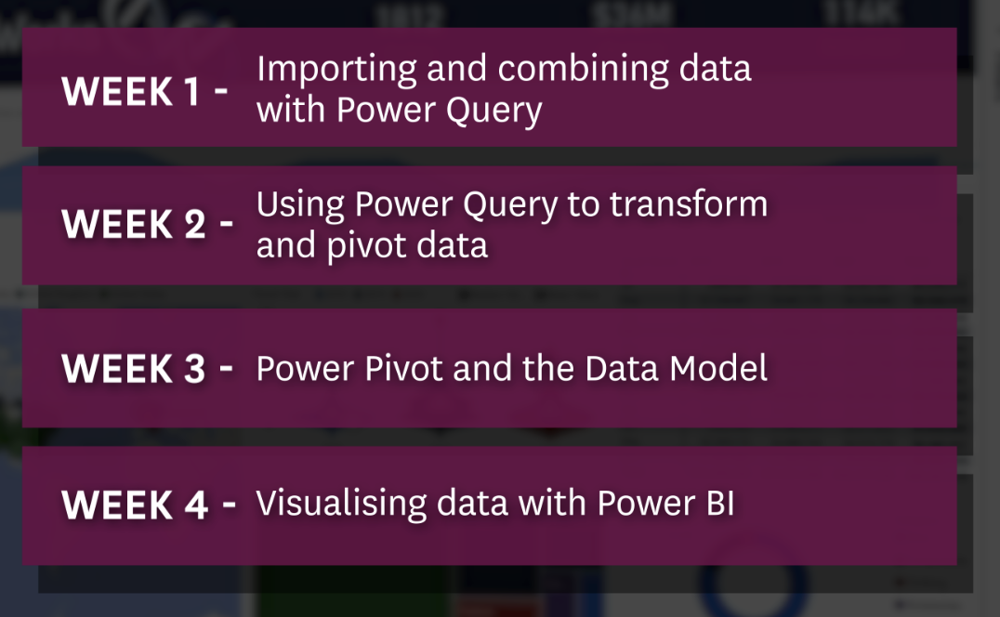

## Excel Power Tools for Data Analysis
[Coursera](https://www.coursera.org/learn/excel-power-tools/supplement/k69We/download-the-week-1-workbooks)



Excel 365

---

### Power Query:
*A data transformation and data preparation engine. Built-in to Excell for Windows from 2016 onwards.
Available as na add on in Excel 2010 and Excel 2013.*

> At Get & transform section

Home > Format as table

---

### Quizz1
**Question 1:
Which of the following sources does Power Query allow us to Get Data from?**

<span style="color:red">A: A folder,an online service, a database, a PDF.</span>

**Question 2:
What would happen if you tried to create a query from data in the current workbook that is not part of a table or a named range?**

<span style="color:red">A: If the selected data is not part of a table or a named range, it will be converted into a named range.</span>

**Question 3:
In Australia, for a phone number such as 0223789456, the first two digits represents the area code. Consider a field that contains phone numbers in this format. What would be the appropriate option under Split Column to extract the area code?**

<span style="color:red">A: By Number of characters, By Position</span>

**Question 4:
If you are utilising Power Query primarily as a 'working space' without viewing the data in your spreadsheet, within Close & Load to, you should choose the option:**

<span style="color:red">A: Only Create Connection</span>

**Question 5:
After creating a new Table via Power Query, what would happen when the original data is edited or changed?**

<span style="color:red">A: nothing</span>

---

*Does Power Query affect original data?
Making any changes in Query Editor won't affect the source data stored in excel sheet. If you update the source data in excel sheet, you should click the refresh button manually so that the dataset loaded to desktop will be updated correspondingly.* ([source](https://community.powerbi.com/t5/Desktop/What-happens-to-the-original-data-that-I-edit-in-the-Power-BI/m-p/395432#:~:text=Making%20any%20changes%20in%20Query,desktop%20will%20be%20updated%20correspondingly.))

---

### Training Schedule
It is kept in a master workbook, external to our system, which we can access but can't change.

## Quizz2: Get and transform data from Excel

**Question 1:
When getting data from another workbook, it is essential to transform the data within that workbook first.**

<span style="color:red">A: False</span>

**Question 2:
What are some differences between Power Query and standard Excel?**

<span style="color:red">A:</span>

<span style="color:red">The formula bar uses a programming language called M in Power Query, unlike in Excel.
You cannot edit or format a cell in Power Query whereas you can in Excel.</span>

<span style="color:red">You cannot rename columns in Power Query whereas you can in Excel.</span>

<span style="color:red">Power Query does not work at the cell level, whereas you can in Excel.</span>

**Question 3:
Alex was working in Power Query and loaded the data into a new worksheet. He notices that he has made an error and needs to undo one of his steps. What should he do?**

<span style="color:red">A: Go to Queries & Connections, choose the relevant query, click on Edit, go to Query Settings, and delete the relevant Applied Step</span>

---

### Opening datasets from

- `Training schedule.xlsx`
- `staff.accdb`: it didn't work because I don't have the [drive](https://help.nicelabel.com/hc/en-001/articles/4405121445521-Using-Excel-XLSX-and-Access-ACCDB-Data-Source-in-Office-365#solution-1-2). I decided to not install it for now.
    - Changes datetime to date
    - Join first name and last name
    ```transform>merge columns>separator:space>new column name>ok```
    - `Home>close&load>close&load`
    - Refresh

## Quizz3: Get the database
**Question 1:
When getting data from a database, unlike getting data from a spreadsheet you have to transform the data at the source first.**

<span style="color:red">A: False</span>

**Question 2:
There are currently three columns in Power Query: Street Address, City, State, with data such as "42 Wallaby Way" (Street Address), "Sydney" (City), "NSW" (State).**

**What could we do to create a new column that displayed the full address as a single string, such as: "42 Wallaby Way, Sydney, NSW"?**

<span style="color:red">A: Select the relevant columns, click on Merge Columns and choose a custom separator ", ".</span>

**Question 3:
If you created a table in Excel after getting data from a database, changing the data in the new table will update the original database if you click Refresh.**

<span style="color:red">A: False</span>

---