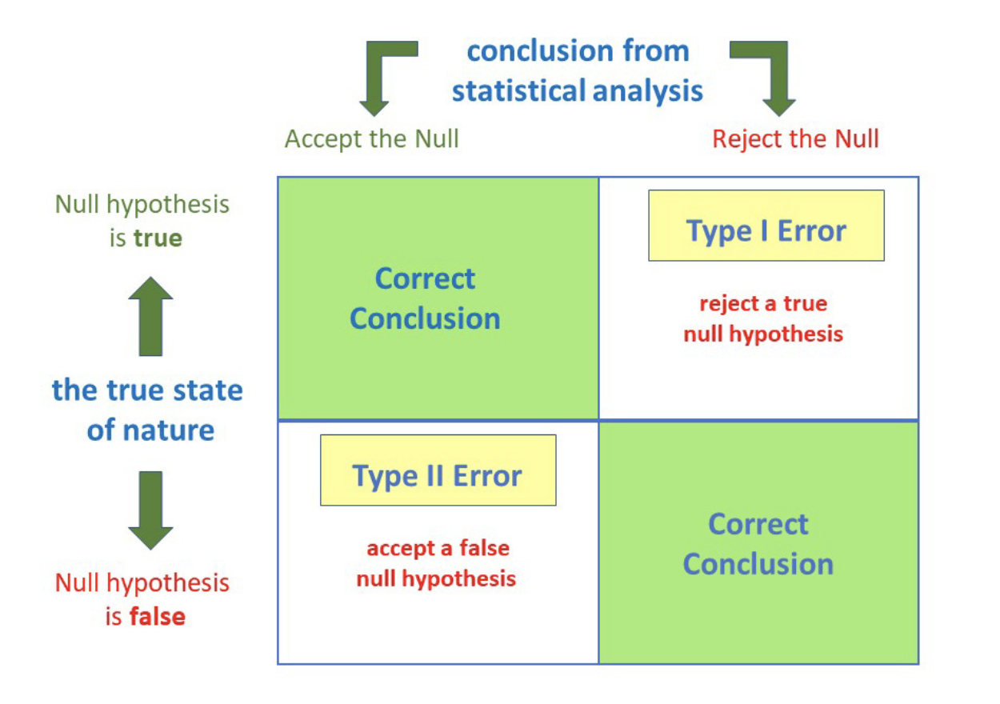
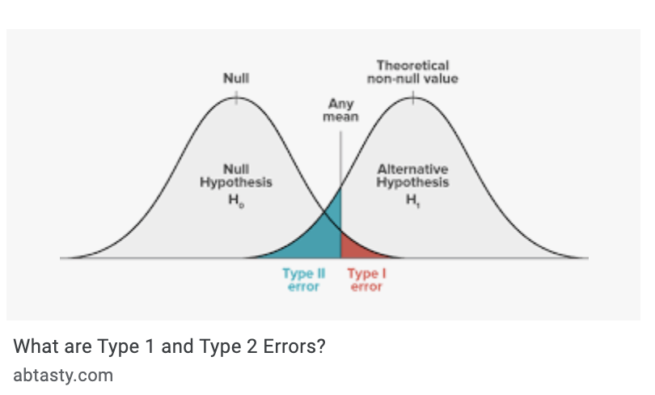
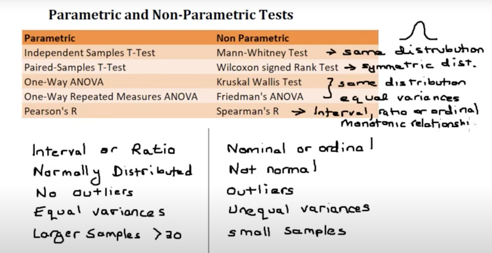

# Statistics
### A/B testing, Power Analysis
[picture_for_media](Photo by <a href="https://unsplash.com/@kmuza?utm_source=unsplash&utm_medium=referral&utm_content=creditCopyText">Carlos Muza</a> on <a href="https://unsplash.com/s/photos/statistics?utm_source=unsplash&utm_medium=referral&utm_content=creditCopyText">Unsplash</a>)
  

 

## AB Testing Process¶
1. **Hypothesis creation:** Understanding business problem & data

2. **Preliminar preparation of the dataset**
    - Detect and resolve problems in the data (Missing Values, Outliers, Unexpected Values)

3. **Experimental design/choice of a Statistical test:**
    - Look summary stats and plots
    - Check Normality & Homogeneity

4. Make **Power analysis** to define the **sample size**
    - Find p-value and alpha value
    - Apply tests (Shapiro, Levene Test, T-Test, Welch Test, Mann Whitney U Test)
    - Evaluate the results

5. **Do the experiment**
    - Apply hypothesis testing and check assumptions

6. **Data exploration**
    - Make inferences

7. **Statistical Analysis of the results**
    - Recommend business decision to your customer/director/ceo etc.

- Power: 80% of time we call statistical significance under the alternative. 

- **“minimal detectable effect” MDE — estimates the smallest improvement you are willing to be able to detect. It determines how "sensitive" an experiment is. 
With 0.8MDE, given sample size and sample variance, we can calculate the smallest real effect size which we would be able to detect at 80% power.**

- H0: null hypothesis: absence of effect (control)
- H1: alternative hypothesis: presence of effect (treatment)
- Statistical significance: comparison between alfa and p-value
- p-value < 0.05: there is a difference (reject H0) SIGNIFICANT
- p-value > 0.05: there is no diference (fail to reject H0) NOT SIGNIFICANT
- p-value = 0 (CRITICAL VALUE = size of difference + sample size + significance)
- Hₒ: p = pₒ
- Hₐ: p ≠ pₒ

- type II error (beta): failure to reject a false H0
- power: probability of detecting an effect which is really there.
- Power = 1 - beta (inversely proportional)
- Convension: Power+0.8 and beta=0.2

- Note: mu(mean), sigma (standard)

- T-test: hypothesis testing, test statistic is compared to the critical value to determine sgnificance.

- If test statistic > critical value: statistical significance and null hyplothesis rejection (t-value > critical t-value)

- Reletionship between variables
-> Effect size: difference of biological interest and variabilidade (std deviation)
-> power of the experiment (80%)
-> significance level (5%, being 5% from one-sized test and 2x2.5% for two-sized test) 
-> sample size
-> alternative hypothesis (one or two-sized test)

- The larger the effect size, the smaller the experiment will need to be to detect it.

Cronology

1- Hypothesis

2- Experimental design/choice of a Statistical test

3- Power Analysis: Sample size

4- Experiment(s)

5- Data exploration

6- Statistical Analysis of the results

<!--  -->

<!--  -->

- p-value (p): Probability of obtaining a result equal to or more extreme than was observed in the data.

- **Type I Error.** Reject the null hypothesis when there is in fact no significant effect (false positive). The p-value is optimistically small.

- **Type II Error.** Not reject the null hypothesis when there is a significant effect (false negative). The p-value is pessimistically large.

- Usual value for Statistical Power = 80%,being 20% of false negatives.

- **Low Statistical Power:** Large risk of committing Type II errors, e.g. a false negative.

- **High Statistical Power:** Small risk of committing Type II errors.

### Power Analysis (Student's t Test Power Analysis)

- **Effect Size.** The quantified magnitude of a result present in the population. *(using Pearson’s correlation coefficient for the relationship between variables or Cohen’s d of at least 0.80)* 

- **Sample Size.** The number of observations in the sample.

- **Significance (alpha).** Boundary for specifying a statistically significant finding when interpreting the p-value. (5%)

- **Statistical Power.**  The probability of accepting the alternative hypothesis if it is true. (80%)

<!--  -->

> [Source](https://machinelearningmastery.com/statistical-power-and-power-analysis-in-python/)

 [PowerCalculator](https://bookingcom.github.io/powercalculator/)
