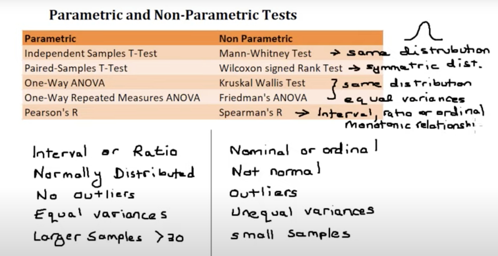

# Power Analysis and A/B testing

## Statistical test
Compare the means of samples to find the Power (P-value). >> The probability we correctly reject the Null Hypothesis.
- P-value > 0.05 : over the threshold that we are using to define a statistically significant difference. So, maybe all of the measurements represent the same distribution in the middle.

### What affect the Power:

1- How much overlap there is between the two distributions.
Overlap is affected by the distance between population means and theis standard deviations.

How to calculate it, example:

    Effect Size(d) = estimated difference in the means / the pooled estimated standard deviation

   

2- The sample size: the number of measurements we collect from each group. The larger the sample size, the higher the power.

Even when the distributions overlap, if the Sample Size is large, we can have high Power.

When the variance of means of the items of the population is high, many will be far from the population mean and our confidence in it is low (25% to each side).

We should choose a number of samples (sample size) and compare their means with the mean of the population.

> The common value for Power is 0.8 (80% probability to correctly reject the Null hypothesis)

> alpha a: threshold for significance, between 0 and 1. The commun value is 0.05.

### Central limit Theorem
 [TODO] check central limit theorem

### P-hacking
When we add new observations to recalculate the means and redo the statistical test. This is a bad practice.

### Power Analysis
To determine the sample size to do the experiment next time, in order to ensure a high probability that we correctly reject the null hypothesis >> there is no difference between the two groups.

Reference: [Statquest](https://www.youtube.com/watch?v=VX_M3tIyiYk)
___________

Power Statistic: estimation of an appropriate sample size
- Sample distribution
- alfa: probability of type I error(0.05) , confidence level of 95%
- p-value: probability that the observed statistic occurred by chance alone. We reject the null hypothesis if p-value is very low. The conventional threshold for rejecting the null hypothesis is 5%.
- power:  probability that an experiment will flag a real change as statistically significant. The convention is to require 80% power. Power depends on magnitude of the change, and variance among samples.
- true-effect: the actual difference of mean between the buckets that would have been observed if we had infinitely large sample sizes. It’s a fixed but unknown parameter, which we are trying to infer.

- False positives — the 5% chance of getting a measurement under the null hypothesis that is so far from the mean that we call it statistically significant.

- Power: 80% of time we call statistical significance under the alternative.

- “minimal detectable effect” MDE — estimates the smallest improvement you are willing to be able to detect. It determines how "sensitive" an experiment is.
With 0.8MDE, given sample size and sample variance, we can calculate the smallest real effect size which we would be able to detect at 80% power.

> H0: null hypothesis: absence of effect (control)

> H1: alternative hypothesis: presence of effect (treatment)
- Statistical significance: comparison between alfa and p-value

> p-value < 0.05: there is a difference (reject H0)

SIGNIFICANCE

> p-value > 0.05: there is no diference (fail to reject H0) NOT SIGNIFICANT

> p-value = 0 (CRITICAL VALUE = size of difference + sample size + significance)

> Hₒ: p = pₒ

> Hₐ: p ≠ pₒ

- type II error (beta): failure to reject a false H0
- power: probability of detecting an effect which is really there.
- Power = 1 - beta (inversely proportional)
- Convension: Power+0.8 and beta=0.2

- Note: mu(mean), sigma (standard)

- T-test: hypothesis testing, test statistic is compared to the critical value to determine sgnificance.

- If test statistic > critical value: statistical significance and null hyplothesis rejection (t-value > critical t-value)

- Reletionship between variables
> Effect size: difference of biological interest and variabilidade (std deviation)

> power of the experiment (80%)

> significance level (5% or a = 0.05, being 5% from one-sized test and 2x2.5% for two-sized test)

> sample size
-> alternative hypothesis (one or two-sized test)

- The larger the effect size, the smaller the experiment will need to be to detect it.

Cronology

    1- Hypothesis creation

    2- Experimental design/choice of a Statistical test

    3- Power Analysis: Sample size

    4- Experiment(s)

    5- Data exploration

    6- Statistical Analysis of the results

How to decide the type of test without checking the distribution?

   

[Source](https://www.statisticshowto.com/probability-and-statistics/statistics-definitions/parametric-and-non-parametric-data/)

